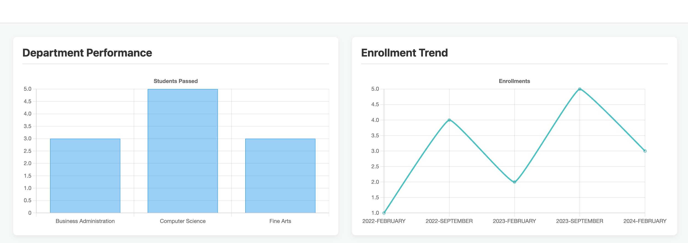
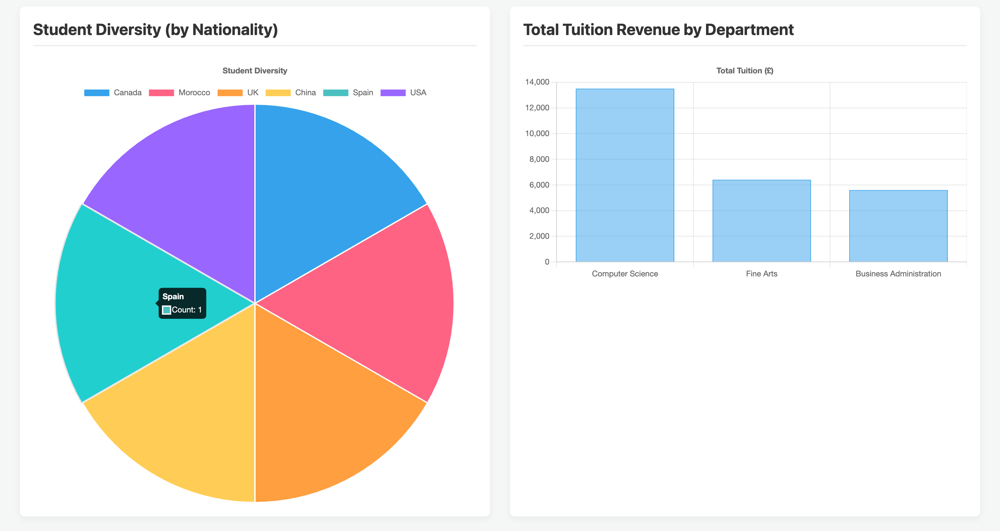
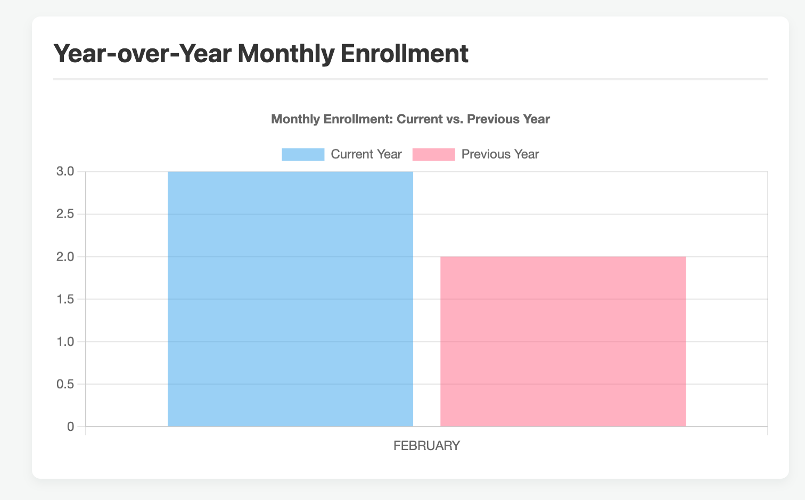

# University Data Warehouse & Reporting Tool

A comprehensive data warehouse project for a university, featuring an automated ETL process and a secure web application for generating analytical reports for decision-makers.

---


## Screenshots








## Features

* **Star Schema Data Warehouse:** Optimized for fast analytical queries.
* **Automated ETL Process:** Built with Java and Spring Boot to extract, transform, and load data from an operational database.
* **Secure Web Application:** Powered by Spring Security, featuring robust authentication and role-based authorization.
* **Role-Based Dashboards:** Different users (e.g., Vice-Chancellor vs. Head of Department) see different reports tailored to their roles.
* **Interactive Reports:** Dynamic charts and tables created with Chart.js to visualize key university metrics.

---

## Technology Stack

* **Backend:** Java 17, Spring Boot, Spring Security, Spring Data JDBC
* **Database:** PostgreSQL
* **Build Tool:** Apache Maven
* **Frontend:** Thymeleaf, HTML, CSS, JavaScript
* **Data Visualization:** Chart.js

---

## Setup and Deployment

Follow these steps to get the project running locally.

### 1. Prerequisites
* Java 17 (or newer)
* Apache Maven
* PostgreSQL
* Git

### 2. Database Setup
1.  In your PostgreSQL client (e.g., pgAdmin), create two empty databases:
    * `university_operational_db`
    * `university_warehouse_db`
2.  Connect to the `university_operational_db` and run the following scripts from the `database_scripts` folder in order:
    * `operational_db_schema.sql`
    * `security_schema.sql`
    * `sample_data.sql`
3.  Connect to the `university_warehouse_db` and run the following script:
    * `warehouse_db_schema.sql`

### 3. Application Configuration
1.  Navigate to `warehouse-etl/src/main/resources/`.
2.  Make a copy of the `application-local.properties.template` file and rename it to `application-local.properties`.
3.  Open the new `application-local.properties` file and replace `"YOUR_POSTGRES_PASSWORD"` with your actual PostgreSQL password.

### 4. Run the Application
1.  Open a terminal or command prompt.
2.  Navigate to the `warehouse-etl` directory inside the project.
3.  Run the application using the Maven wrapper:
    ```bash
    ./mvnw spring-boot:run
    ```
4.  The first time you run the application, it will execute the complete ETL process to populate the data warehouse. This may take a moment.

---

## Usage

Once the application is running:

1.  Open your web browser and navigate to `http://localhost:8080`.
2.  You will be redirected to the login page.
3.  Use one of the following accounts to log in (the password for all users is **`password123`**):

| Username      | Role                  | Expected View                                   |
|---------------|-----------------------|-------------------------------------------------|
| `vchancellor` | Vice-Chancellor (VC)  | Full dashboard with all university-wide reports.|
| `hod_cs`      | Head of Department    | Focused dashboard for Computer Science only.    |
| `hod_ba`      | Head of Department    | Focused dashboard for Business Admin only.      |
| `admin`       | Administrator         | Same view as the Vice-Chancellor.               |